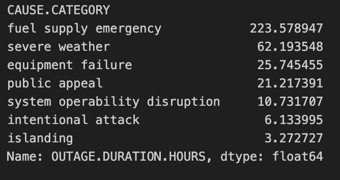

# Understanding Power Outage Severity in the United States

## Step 1: Introduction

Power outage is a major threat to the infrastructure systems of the world. Power outage can affect the transport system, communication system, medical system, business sector and normal daily life of people.

I do an analysis in the current project on the power outages events that occurred at a large scale in the US. The dataset that I carryout analysis on has **1534 rows**, where each row represents a single outage event.

The central question of this project is:

**Can we predict whether a power outage will become a long outage based on information about the outage’s cause, time, location, and impact?**

This question matters because extended outages can have serious costs and safety impacts to the affected areas.

### Relevant Columns

- **CAUSE.CATEGORY** – reason for the outage (weather, technical problems, etc.)
- **MONTH** – month when the outage occurred
- **U.S._STATE** – state where the outage occurred
- **DEMAND.LOSS.MW** – electricity demand lost
- **CUSTOMERS.AFFECTED** – number of customers affected

These variables will be incorporated into predictive models that will project long outages.

## Step 2: Data Cleaning and Exploratory Data Analysis

### Data Cleaning

Before performing the analysis, several data cleaning steps were taken. 
Missing values were handled appropriately and important columns such as 
`OUTAGE.DURATION.HOURS` and `CUSTOMERS.AFFECTED` were converted to numeric 
formats. Additionally, outage duration was computed from outage start and 
restoration times when necessary.

---

### Univariate Analysis

The following plot shows the distribution of outage duration in hours.

<iframe
  src="assets/outage_duration_distribution.html"
  width="800"
  height="600"
  frameborder="0"
></iframe>

Most outages are relatively short in duration, but the distribution has a 
long right tail indicating that a small number of outages last for very 
long periods.

The next plot shows the distribution of the number of customers affected.

<iframe
  src="assets/customers_affected_distribution.html"
  width="800"
  height="600"
  frameborder="0"
></iframe>

This distribution is also heavily right-skewed, suggesting that most outages 
affect relatively small numbers of customers while a few events impact very 
large populations.

---

### Bivariate Analysis

The following plot examines the relationship between outage duration and 
climate category.

<iframe
  src="assets/climatecategory_outageduration.html"
  width="800"
  height="600"
  frameborder="0"
></iframe>

Although most outages remain short across all climates, colder climates 
appear to show slightly more variability in outage duration.

Another comparison examines outage duration across different outage causes.

<iframe
  src="assets/Cause_Category_Outage_Duration.html"
  width="800"
  height="600"
  frameborder="0"
></iframe>

Certain outage causes such as **fuel supply emergencies** and **severe weather**
appear to be associated with longer outage durations compared to other causes.

---

### Interesting Aggregates

The following table summarizes the **average outage duration grouped by 
cause category**.

From this table we observe that **fuel supply emergencies lead to the 
longest outages on average**, followed by severe weather events. Other 
causes such as islanding or intentional attacks tend to result in much 
shorter outages.

## Step 3: Assessment of Missingness

### MNAR Analysis

CUSTOMERS.AFFECTED is one of the columns that has the most missing values in the datasets. We can suppose that CUSTOMERS.AFFECTED might be MNAR. In real-life outage scenarios, not all cases might have a number of customers affected. As an example, in cases of a powerful storm or any other emergency, the utility companies fix the outage and do not occupy themselves with statistics. In these particular cases, the missing data can be said to be associated with the severity of the outage or the circumstances surrounding it.

If we had more contextual data, for example, utility reporting data or additional details about what actually happened in the field, we could potentially understand more about the missing values. With such contextual data, we would be in a position to assess the degree of MNAR versus MAR.

### Missingness Dependency

In order to investigate the dependence of the missingness of CUSTOMERS.AFFECTED on other variables, I generated a boolean indicator column, CUST_MISSING, to denote whether the value in CUSTOMERS.AFFECTED is missing.

I compared the length of outages for instances when CUSTOMERS.AFFECTED is null vs when it is not null. The plot below shows the density of outages when CUSTOMERS.AFFECTED is null compared to when it is not null.

<iframe
  src="assets/missness.html"
  width="800"
  height="600"
  frameborder="0"
></iframe>

Next, I conducted a permutation test to evaluate whether the difference in average outage duration between the two sets of locations was by chance. First, the actual difference in the means of outage durations was computed. Then, the missing indicator was randomly permuted 1000 times, and the difference of the means was recalculated for each permutation.

The p-value obtained was close to 0.027. Because this is lower than the widely accepted alpha level of 0.05, it can be concluded that the missingness of CUSTOMERS.AFFECTED is dependent on the length of the outage and that the missed values could be considered nonrandom and conditionally dependent on certain factors of the outage.

## Step 4: Hypothesis Testing

### Hypothesis Test

I test whether outages caused by severe weather tend to have different average outage durations than outages caused by other causes.

**Null Hypothesis (H₀):**  
The average outage duration is the same for outages caused by severe weather and outages caused by other causes.

**Alternative Hypothesis (H₁):**  
The average outage duration is different for outages caused by severe weather and outages caused by other causes.

**Test Statistic:**  
Difference in mean outage duration between severe weather outages and non-severe weather outages.

**Significance Level:**  
α = 0.05

**Method:**  
Permutation test with 1000 simulations.

**Observed Statistic:**  
The observed difference in mean outage duration is approximately **41.28 hours**.

**P-value:**  
The resulting p-value is approximately **0.0**.

**Conclusion:**  
Since the p-value is smaller than 0.05, I reject the null hypothesis. This provides evidence that outages caused by severe weather have a different average outage duration than outages caused by other causes. In the sample, severe weather outages last longer on average.

### Permutation Test Visualization

<iframe
src="assets/permutation_test.html"
width="800"
height="600"
frameborder="0"
></iframe>

The histogram above shows the permutation distribution of the test statistic under the null hypothesis. The red vertical line marks the observed difference in mean outage duration. Since the observed statistic lies far in the right tail of the null distribution, the resulting p-value is extremely small.

## Step 5: Framing a Prediction Problem

### Prediction Problem

The goal of this prediction task is to determine whether a power outage will last longer than **24 hours**.

This is a **binary classification problem**, where the response variable is **`LONG_OUTAGE`**.

- `LONG_OUTAGE = 1` indicates the outage duration exceeds 24 hours.
- `LONG_OUTAGE = 0` indicates the outage duration is 24 hours or less.

This threshold was chosen because outages lasting more than a full day can cause significant disruption to infrastructure systems, businesses, and daily life.

### Evaluation Metric

The model will be evaluated using **F1-score**. Since long outages are less common than shorter outages, the dataset is somewhat imbalanced. Accuracy alone could therefore be misleading, as a model that always predicts short outages might still achieve a high accuracy. The F1-score balances **precision and recall**, making it a more appropriate metric for evaluating performance on this classification problem.

### Time of Prediction

At the time of prediction, we assume that we know information about the outage **cause, time, location, and environmental conditions**, but we do **not yet know the outage duration**. Therefore, the model will only use features that would realistically be available when the outage begins. Variables that depend on the actual outage duration will not be used as predictors.

## Step 6: Baseline Model

### Baseline Model

For the baseline model, I use **logistic regression** to predict whether an outage lasts longer than 24 hours.

The model uses two features:

- **CAUSE.CATEGORY** (categorical, nominal): the cause of the outage.
- **MONTH** (numeric / ordinal): the month in which the outage occurred.

Since `CAUSE.CATEGORY` is categorical, I encode it using **OneHotEncoder** before fitting the model.  
The feature `MONTH` is numeric and is used directly without transformation.

The preprocessing and model training steps are implemented using a **scikit-learn Pipeline**, which ensures that encoding and model training are applied consistently.

### Evaluation Metric

Model performance is evaluated using the **F1-score**, since the dataset contains more short outages than long outages. The F1-score balances **precision and recall**, making it more suitable than accuracy for evaluating performance on an imbalanced classification problem.

### Model Performance

The baseline logistic regression model achieves an **F1-score of approximately 0.59** on the test set.

### Interpretation

This baseline model provides a simple reference point for predicting long outages. While the model captures some information from outage cause and timing, the performance suggests that additional features may help improve prediction accuracy. Therefore, more informative predictors will be explored in the final model.

## Step 7: Final Model

### Additional Features

To improve upon the baseline model, I constructed a final model that incorporates additional modeling improvements.

The baseline model used the following features:
- **CAUSE.CATEGORY** (categorical, nominal): the cause of the outage.
- **MONTH** (numeric / ordinal): the month in which the outage occurred.

These features capture some basic information about outages, but additional modeling improvements can help the model better identify patterns associated with long outages.

### Model Choice

The final model uses **logistic regression**, since the prediction task is a **binary classification problem** where the goal is to predict whether an outage lasts longer than 24 hours.

Logistic regression is appropriate for this task because it provides an interpretable probabilistic model while still being able to incorporate encoded categorical variables.

### Hyperparameter Tuning

To improve the model, I tuned the **regularization strength parameter `C`** of the logistic regression model.

Hyperparameter tuning was performed using **GridSearchCV** with 5-fold cross-validation and **F1-score** as the evaluation metric.

The following candidate values were tested:
C = [0.01, 0.1, 1, 10, 100]
The best performing hyperparameter value found was:
C = 100

### Model Performance

The model performance is evaluated using **F1-score**, since the dataset contains more short outages than long outages and F1-score balances precision and recall.

| Model | F1 Score |
|------|------|
| Baseline Model | 0.593 |
| Final Model | 0.694 |

### Interpretation

The final model improves the F1-score from **0.593 to 0.694**, indicating that the tuned model is better at identifying long outages while maintaining a balance between precision and recall.

This improvement suggests that hyperparameter tuning helps the model better capture relationships between outage causes, seasonal timing, and outage duration.

## Step 8: Fairness Analysis

To evaluate whether the final model performs differently across outage causes, I conducted a fairness analysis comparing prediction performance for outages caused by **severe weather** versus outages caused by **other factors**.

### Groups

The two groups were defined as:

- **Group X:** outages caused by **severe weather**
- **Group Y:** outages caused by **all other causes**

These groups were created using the `CAUSE.CATEGORY` column.

### Evaluation Metric

The evaluation metric used for the fairness analysis is **classification accuracy**, which measures the proportion of correct predictions.

### Observed Difference

The observed accuracies were:

- Accuracy for **severe weather outages:** 0.718  
- Accuracy for **other outages:** 0.932  

Observed difference:
Accuracy(severe weather) − Accuracy(other causes) = −0.214

This indicates that the model performs worse when predicting outages caused by severe weather.

### Hypotheses

**Null Hypothesis (H₀):**  
The model performs equally well for severe weather outages and other outages. Any observed difference in accuracy is due to random chance.

**Alternative Hypothesis (H₁):**  
The model performs differently for severe weather outages compared to other outages.

### Permutation Test

To test this hypothesis, I performed a **permutation test with 1000 simulations**.

During each simulation:

1. The group labels (`SEVERE`) were randomly shuffled.
2. The difference in accuracy between the two groups was recomputed.
3. This produced a distribution of simulated differences under the null hypothesis.

The p-value was computed as the proportion of simulated differences with magnitude greater than or equal to the observed difference.

### Results

The permutation test produced a **p-value ≈ 0.0**.

Since this p-value is far below the typical significance level of **α = 0.05**, we reject the null hypothesis.

### Conclusion

The results suggest that the model performs significantly differently for outages caused by severe weather compared to outages caused by other causes.

Specifically, the model appears to be **less accurate when predicting outages caused by severe weather**, indicating that the model may have fairness limitations across different outage causes.

The visualization below shows the permutation distribution of accuracy differences, with the observed difference marked by the red line.

<iframe
src="assets/fairness_test.html"
width="800"
height="600"
frameborder="0"
></iframe>
