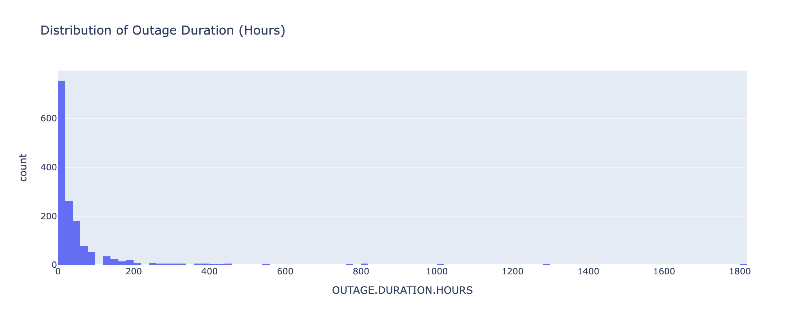
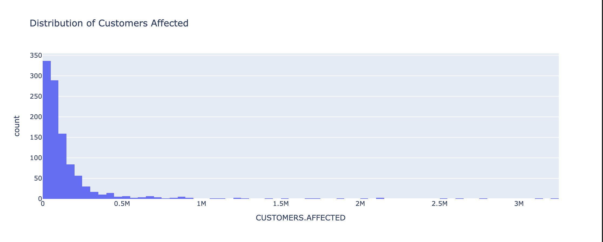
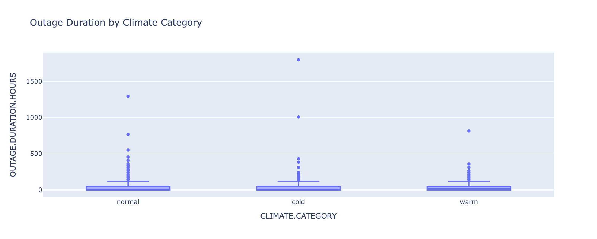
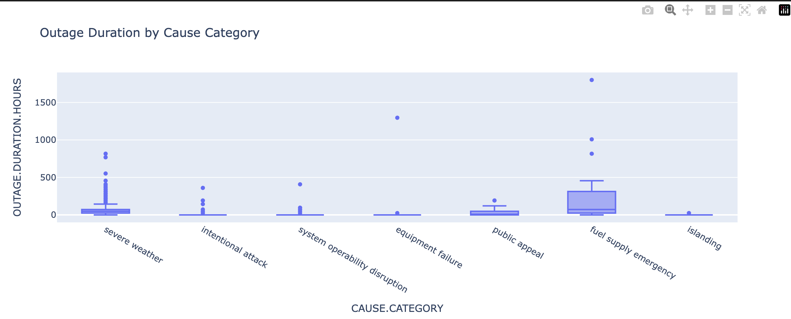
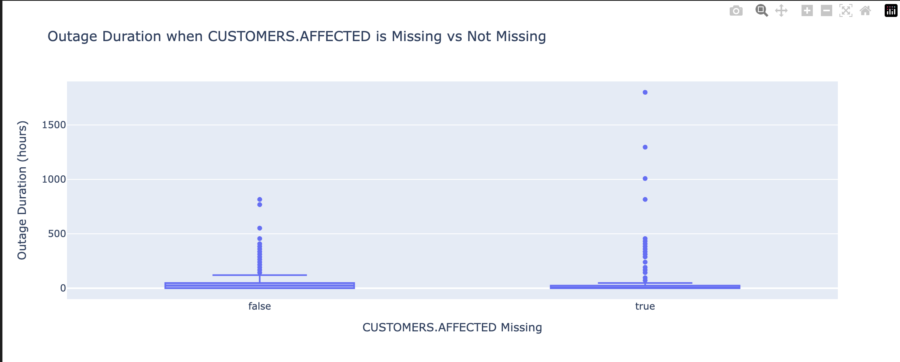

# Understanding Power Outage Severity in the United States

## Step 1: Introduction

Power outage is a major threat to the infrastructure systems of the world. Power outage can affect the transport system, communication system, medical system, business sector and normal daily life of people.

I do an analysis in the current project on the power outages events that occurred at a large scale in the US. The dataset that I carryout analysis on has **1534 rows**, where each row represents a single outage event.

The central question of this project is:

**Can we predict whether a power outage will become a long outage based on information about the outage’s cause, time, location, and impact?**

This question matters because extended outages can have serious costs and safety impacts to the affected areas.

### Relevant Columns

- **CAUSE.CATEGORY** – reason for the outage (weather, technical problems, etc.)
- **MONTH** – month when the outage occurred
- **U.S._STATE** – state where the outage occurred
- **DEMAND.LOSS.MW** – electricity demand lost
- **CUSTOMERS.AFFECTED** – number of customers affected

These variables will be incorporated into predictive models that will project long outages.

## Step 2: Data Cleaning and Exploratory Data Analysis

### Data Cleaning

Before performing the analysis, several data cleaning steps were taken. 
Missing values were handled appropriately and important columns such as 
`OUTAGE.DURATION.HOURS` and `CUSTOMERS.AFFECTED` were converted to numeric 
formats. Additionally, outage duration was computed from outage start and 
restoration times when necessary.

---

### Univariate Analysis

The following plot shows the distribution of outage duration in hours.

Most outages are relatively short in duration, but the distribution has a 
long right tail indicating that a small number of outages last for very 
long periods.

The next plot shows the distribution of the number of customers affected.

This distribution is also heavily right-skewed, suggesting that most outages 
affect relatively small numbers of customers while a few events impact very 
large populations.

---

### Bivariate Analysis

The following plot examines the relationship between outage duration and 
climate category.

Although most outages remain short across all climates, colder climates 
appear to show slightly more variability in outage duration.

Another comparison examines outage duration across different outage causes.

Certain outage causes such as **fuel supply emergencies** and **severe weather**
appear to be associated with longer outage durations compared to other causes.

---

### Interesting Aggregates

The following table summarizes the **average outage duration grouped by 
cause category**.

From this table we observe that **fuel supply emergencies lead to the 
longest outages on average**, followed by severe weather events. Other 
causes such as islanding or intentional attacks tend to result in much 
shorter outages.

## Step 3: Assessment of Missingness

### MNAR Analysis

`CUSTOMERS.AFFECTED` is one of the columns that has the most missing values in the dataset. We can suppose that `CUSTOMERS.AFFECTED` might be **MNAR (Missing Not At Random)**. In real-life outage scenarios, not all cases may report the number of customers affected. For example, during severe storms or emergency situations, utility companies may focus on restoring power rather than recording detailed statistics. In these situations, the missing values could be related to the severity of the outage or the circumstances surrounding it.

If additional contextual information were available, such as utility reporting records or more detailed operational data about outage events, we might better understand the reason behind these missing values. With this additional information, we could determine whether the missingness is truly MNAR or whether it could instead be explained by other observed variables, which would make the data closer to MAR (Missing At Random).

---

### Missingness Dependency

To investigate whether the missingness of `CUSTOMERS.AFFECTED` depends on other variables, I created a boolean indicator column called `CUST_MISSING`, which indicates whether the value in `CUSTOMERS.AFFECTED` is missing.

I then compared outage durations for events where `CUSTOMERS.AFFECTED` is missing and where it is not missing. The plot below shows the distribution of outage durations for these two groups.

Next, I conducted a **permutation test** to determine whether the difference in average outage duration between the two groups occurred by chance. First, the observed difference in the mean outage duration was calculated. Then, the missingness indicator was randomly permuted 1000 times, and the difference in means was recomputed for each permutation.

The resulting **p-value was approximately 0.027**. Since this value is below the common significance threshold of 0.05, it suggests that the missingness of `CUSTOMERS.AFFECTED` is related to outage duration. This indicates that the missing values may not be completely random and could depend on characteristics of the outage event.
